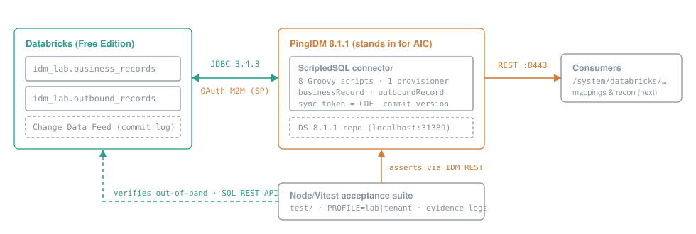

# dbx-aic-lab — Databricks ⇄ PingAIC connector lab

A working prototype of a **bidirectional ICF connector between Databricks and
PingOne Advanced Identity Cloud**, built and validated on a local lab:
self-hosted PingIDM 8.1.1 stands in for AIC (AIC's sync engine *is* IDM, so
provisioner and mapping config ports to a tenant nearly unchanged), and a
Databricks Free Edition workspace is the real target — driver compatibility
was the whole question, so Databricks is never mocked.

The lab runs the same connector **two ways, kept side by side on purpose**:

- **Plain JVM** — the connector in-process in IDM, or hosted by a Java
  Remote Connector Server (RCS) running directly on the machine.
- **Kubernetes** — the RCS as pods in a local cluster (minikube), rehearsing
  a managed-Kubernetes deployment on any major cloud.

Neither path replaces the other. One acceptance suite runs against every
topology, so results are comparable, and the development friction of each
is logged in [k8s-dev-experience.md](docs/k8s-dev-experience.md). The
connector-vs-RCS distinction, how each scales, and how RCS availability
overlays Kubernetes are in [design.md](docs/design.md#connector-vs-rcs).

> **Status: spike/prototype, not production.** Phase 1 (in-process connector)
> is complete and evidence-backed — CRUD, paging, filtered queries, and
> CDF-based liveSync including delete detection, authenticated as a
> service principal via OAuth M2M. Phase 2 (RCS on the plain JVM, then on
> Kubernetes) is researched and not yet built. Nothing here has been
> hardened, load-tested, or security-reviewed. Copy patterns, not guarantees.



## What's decided, and why

- **Connector: ScriptedSQL (Groovy)** over the config-only DatabaseTable
  connector — decided by authentication posture (production needs
  service-principal OAuth M2M with secrets kept out of plaintext config,
  which only the scripted connector reaches cleanly) plus single-provisioner
  topology and CDF delete detection. Full trade-off analysis with citations:
  [ADR-001](docs/adr-001-connector-selection.md).
- **Sync: Delta Change Data Feed** — the sync token is the Delta commit
  version, so liveSync sees inserts, updates, **and deletes**.
- **Auth: OAuth M2M as a service principal** — assembled at connector init
  by a customizer script from an IDM-encrypted config property; works on
  Databricks **Free Edition** (a commonly repeated claim that it doesn't was
  disproven empirically — see [spike results](docs/spike-results.md)). A PAT
  is supported as an optional alternative, never required:
  [ADR-002](docs/adr-002-databricks-authentication.md).

The documentation trail, in reading order:
[ADR-001](docs/adr-001-connector-selection.md) (why this connector) →
[ADR-002](docs/adr-002-databricks-authentication.md) (why OAuth M2M) →
[design](docs/design.md) (the as-built system) →
[plan](docs/plan.md) (phases and status) →
[Databricks requirements](docs/databricks-requirements.md) (what a data team must provide) →
[spike results](docs/spike-results.md) (dated findings, including retracted
ones). Phase-2 background: [RCS and Kubernetes research](docs/rcs-kubernetes-research.md).

## What you need

Versions are pinned here only; other docs link back. Licensing and
redistribution for each vendor artifact: [NOTICE](NOTICE.md).

**Both paths**

| Dependency | Version | Notes |
|---|---|---|
| Ping Identity Backstage account | — | PingIDM/PingDS/RCS are proprietary, **not in this repo, not redistributable** |
| PingIDM | 8.1.1 (`IDM-8.1.1.zip`, repo root) | Sync engine standing in for AIC; ships the ScriptedSQL connector |
| PingDS | 8.1.1 (`DS-8.1.1.zip`, repo root) | IDM's required repository |
| Databricks workspace | Free Edition works | SQL warehouse, Unity Catalog, a service principal with an OAuth secret (OAuth M2M; a PAT is optional — [ADR-002](docs/adr-002-databricks-authentication.md)) |
| Databricks JDBC driver | `databricks-jdbc` 2.7.3 (Maven Central, Apache-2.0) | Fetched, never committed |
| JDK 21 / JDK 25 | Homebrew `openjdk@21`, `openjdk@25` | IDM + RCS need 21; DS needs 25 (see prerequisites) |
| Node.js | 18+ | Acceptance suite (Vitest) |
| Maven | any | One-time driver fetch |

**Plain-JVM RCS path (phase 2)**

| Dependency | Version | Notes |
|---|---|---|
| Java RCS | 1.5.20.36 (from the official image via `rcs/fetch-rcs.sh`, or the Backstage zip) | Extracted to `rcs/openicf/` (gitignored); JDK 21 |

**Kubernetes path (phase 2)**

| Dependency | Version | Notes |
|---|---|---|
| RCS image | `gcr.io/forgerock-io/rcs:1.5.20.36` (amd64 + arm64) | Public pull; use requires a Ping license. Our Dockerfile only adds our own files |
| minikube | 1.38+ | Local cluster; `vfkit` driver on macOS (no Docker needed) |
| vfkit | Homebrew | macOS hypervisor driver for minikube |
| Kubernetes | 1.35 | Pin a minor your target provider supports |
| kubectl, helm | kubectl ±1 minor of the cluster; helm 4 | |

**Phase 3 (real tenant)**: a PingOne AIC tenant, and any managed Kubernetes
(AKS, EKS or GKE) with a private registry, a cloud secret store and workload
identity — provider-neutral design in
[design.md](docs/design.md#cloud-provider-neutrality).

## Quickstart

```bash
# 1. Vendor artifacts (Backstage) -> repo root: IDM-8.1.1.zip, DS-8.1.1.zip
# 2. Stand up DS + IDM: follow the Runbook section below (one-time setup)
# 3. Configure credentials:
cp secrets/databricks.env.example secrets/databricks.env   # then fill it in
# 4. Create the lab tables (CDF on, seed rows) — authenticates as the
#    service principal (OAuth M2M):
databricks/apply-sql.sh databricks/sql/001_lab_tables.sql
# 5. Deploy connector config + scripts into the runtime:
idm-config/deploy.sh
# 6. Prove it works (16 checks; writes test/runs/ + JUnit XML):
cd test && npm install && npm test
#    Offline unit tests (no lab, network or secrets): npm run test:unit
```

The suite needs the live lab — it is a manual gate, not a CI job.

## Layout

| Path | Tracked | Purpose |
|---|---|---|
| `runtime/openidm/` | no (gitignored) | Extracted IDM 8.1.1 — rebuild via `unzip IDM-8.1.1.zip -d runtime/` |
| `runtime/opendj/` | no (gitignored) | Extracted DS 8.1.1 (IDM's repository) — binaries AND live instance data; `rm -rf runtime/` is the lab reset |
| `secrets/` | no (gitignored) | Sensitive material: DS deployment ID, CA cert, Databricks credentials (`databricks.env`) |
| `idm-config/conf/` | yes | Provisioner + mapping JSON (`provisioner.openicf-*.json`, `sync.json`) — copied into `runtime/openidm/conf/` |
| `idm-config/script/` | yes | ScriptedSQL Groovy scripts (one per ICF operation + customizer) |
| `databricks/` | yes | Lab tooling: `smoke-test.sh` (JDBC connectivity), `apply-sql.sh` + `JdbcRunner.java` (run SQL over the driver), `sql/` (DDL, CDF setup, seed data) |
| `test/` | yes | Node/Vitest acceptance suite (`cd test && npm install && npm test`) — IDM REST assertions + Databricks-native out-of-band checks over the SQL Statement Execution REST API; profile-driven (`PROFILE=lab\|tenant`, more per topology as phase 2 lands); writes `test/runs/acceptance-node-*.log` + JUnit XML. `test/unit/`: offline unit tests (`npm run test:unit`) |
| `rcs/` | yes | RCS files we author: `fetch-rcs.sh`, `deploy.sh`, `run.sh`, `conf/{client,server}/ConnectorServer.properties` (Dockerfile and manifests to come) |
| `rcs/openicf/` | no (gitignored) | Extracted Java RCS distribution (proprietary) |
| `docs/` | yes | ADR, design, plan, spike results — the narrative record |
| `test/runs/` | no (gitignored) | Local HTTP request/response logs, one per acceptance/soak run |
| `secrets/databricks.env.example` | yes | Credential template — the only tracked file under `secrets/` |

## Phases

1. **In-process spike** — ScriptedSQL (Groovy) connector jar is already in
   `runtime/openidm/connectors/`; Databricks JDBC jar in `openidm/lib/`;
   author the Groovy scripts, configure one provisioner against Databricks
   Free Edition, run test/recon/CRUD/liveSync (CDF sync token).
2. **RCS in client mode, plain JVM then Kubernetes** — the RCS connects out
   to IDM, the only mode AIC supports. One new layer per step, each must
   pass the unchanged suite: RCS on the Mac → one pod in minikube → two pods
   with failover. Earlier steps stay runnable. (Server mode was run once as
   a stepping stone; it has no production use here.) Steps:
   [plan.md](docs/plan.md).
3. **Real AIC tenant** — RCS pods in a managed Kubernetes cluster (any
   major cloud) in client mode against the tenant. Databricks auth is
   already service-principal OAuth M2M (migrated in the lab — Free Edition
   supports SP OAuth after all; see docs/design.md checklist): recreate SP +
   grants in the tenant workspace, secrets to ESVs.

## Prerequisites (per the 8.1 install guide)

- **Two JDKs — IDM 8.1 requires Java 21; DS 8.1 requires Java 25** (verified:
  DS 8.1.1 classes are compiled for class-file 69). Both installed sudo-free via
  `brew install openjdk@21 openjdk@25`; IDM gets `JAVA_HOME`=21, DS gets
  `DS_JAVA_HOME`=25.
- Repository: **IDM 8.x has no embedded repo — a running PingDS instance is
  required before first boot.** The shipped `conf/repo.ds.json` has
  `"embedded": false` and expects DS at localhost:31389 (startTLS,
  `uid=admin` / `str0ngAdm1nPa55word`). DS-8.1.1.zip lives at the repo root;
  extract to `runtime/opendj/` and set up with the `idm-repo` profile (see
  runbook). DS 8.1 requires Java 25 (see Java bullet above).
  **Base DN (verified):** `repo.ds.json` expects `dc=openidm,dc=forgerock,dc=com`,
  but the `idm-repo` profile defaults to domain `example.com` — setup MUST pass
  `--set idm-repo/domain:forgerock.com`.
- The **legacy admin UI is not bundled in 8.1** (deprecated; separate Backstage
  download). Lab admin happens over REST — connector/mapping config is JSON in
  `conf/` anyway, which suits this repo's tracked-config approach.
- macOS is not a supported OS for production IDM — fine for this lab only.
- Eval sizing: ≥1 GB RAM, 10 GB disk (DS repo wants 5% of filesystem + 1 GB free).

## Runbook

```bash
# Split JDKs via sudo-free Homebrew formulas (temurin casks need interactive
# sudo). One-time: brew install openjdk@21 openjdk@25
# NB: /usr/libexec/java_home can't see keg-only brew JDKs — set paths directly.
export JAVA_HOME="$(brew --prefix openjdk@21)/libexec/openjdk.jdk/Contents/Home"      # IDM
export DS_JAVA_HOME="$(brew --prefix openjdk@25)/libexec/openjdk.jdk/Contents/Home"   # DS tools + server
"$JAVA_HOME/bin/java" -version && "$DS_JAVA_HOME/bin/java" -version || exit 1

# --- one-time DS repo setup (before first IDM start) ---
# Source of truth: PingIDM 8.1 install-guide/external-ds.html +
# PingDS 8.1 install-guide/profile-idm-repo.html.
# The guide's "replace conf/repo.ds.json with db/ds/conf/repo.ds-external.json"
# step is a no-op in IDM 8.1.1 — shipped files are identical (verified by diff).
unzip DS-8.1.1.zip -d runtime/          # -> runtime/opendj
runtime/opendj/bin/dskeymgr create-deployment-id \
  --deploymentIdPassword password > secrets/ds-deployment-id
export DEPLOYMENT_ID=$(cat secrets/ds-deployment-id)
runtime/opendj/setup \
  --deploymentId "$DEPLOYMENT_ID" --deploymentIdPassword password \
  --rootUserDN uid=admin --rootUserPassword str0ngAdm1nPa55word \
  --hostname localhost --adminConnectorPort 34444 --ldapPort 31389 \
  --enableStartTls --profile idm-repo \
  --set idm-repo/domain:forgerock.com \
  --acceptLicense
# optional, per DS guide (IDM manages passwords, not DS):
runtime/opendj/bin/dsconfig set-password-policy-prop \
  --policy-name "Default Password Policy" --reset password-validator --offline --no-prompt
runtime/opendj/bin/dsconfig set-password-policy-prop \
  --policy-name "Root Password Policy" --reset password-validator --offline --no-prompt
# trust: import the deployment-ID CA into IDM's truststore
runtime/opendj/bin/dskeymgr export-ca-cert --deploymentId "$DEPLOYMENT_ID" \
  --deploymentIdPassword password --outputFile secrets/ds-ca-cert.pem
keytool -importcert -noprompt -alias ds-ca-cert -file secrets/ds-ca-cert.pem \
  -keystore runtime/openidm/security/truststore \
  -storepass:file runtime/openidm/security/storepass
runtime/opendj/bin/start-ds

# --- IDM ---
cd runtime/openidm && ./startup.sh
# verify: DS side  -> grep 31389 runtime/opendj/logs/ldap-access.audit.json | tail -1
#         IDM side -> curl -k -u openidm-admin:openidm-admin https://localhost:8443/openidm/info/ping

# Databricks JDBC driver (OSS, Apache 2.0) — goes in openidm/lib/ (third-party
# JDBC drivers, per the ScriptedSQL sample docs), NOT connectors/ (ICF bundles
# only — IDM logs "Failed to add connector" if the driver lands there):
mvn dependency:copy -Dartifact=com.databricks:databricks-jdbc:2.7.3 \
  -DoutputDirectory=runtime/openidm/lib/
```

### Plain-JVM RCS path, client mode (topology T2 — the target)

The RCS connects out to IDM, as it will to AIC.

```bash
cp secrets/rcs.env.example secrets/rcs.env   # RCS_IDM_PRINCIPAL=connector-server-client,
                                             # RCS_IDM_PASSWORD=<random alphanumeric>
rcs/fetch-rcs.sh                   # official image -> rcs/openicf/ (gitignored)
rcs/deploy.sh client               # properties, IDM cert -> RCS truststore, scripts, driver
idm-config/deploy.sh rcs-client    # IDM side: client entry, RCS login + openicf access rule
# First time only: restart IDM — boot.properties (rcs.idm.password) is read at startup.
rcs/run.sh                         # foreground; logs in rcs/openicf/logs/
cd test && PROFILE=rcs-client npm test
# Back to in-process: idm-config/deploy.sh local
```

### Plain-JVM RCS path, server mode (stepping stone, topology T1)

Server mode (IDM connects in to the RCS) isn't supported by AIC; this path
proved the connector works when hosted on an RCS.

```bash
# secrets/rcs.env also needs RCS_KEY (alphanumeric)
rcs/deploy.sh server               # properties + key, scripts, driver
rcs/run.sh                         # foreground; logs in rcs/openicf/logs/
idm-config/deploy.sh rcs           # point IDM's provisioner at the RCS
# First time only: restart IDM — boot.properties (rcs.key) is read at startup.
cd test && PROFILE=rcs npm test
# Back to in-process: idm-config/deploy.sh local
```

### Kubernetes path (topology T3 — RCS pod, client mode)

As run on macOS (minikube 1.38; see the minikube docs for your version).

```bash
brew install vfkit                      # Apple Virtualization.framework driver
minikube delete                         # only if an old docker-driver profile exists
minikube start -p rcs --driver=vfkit --container-runtime=containerd \
  --kubernetes-version=v1.35.0 --cpus=2 --memory=4g
# Pods reach IDM via host.minikube.internal; IDM must listen on all
# interfaces (it does) and present a cert valid for that name:
idm-config/lab-tls-cert.sh              # then restart IDM
rcs/deploy.sh client                    # puts IDM's new cert in the RCS truststore
rcs/k8s/build.sh                        # image built inside the node
rcs/k8s/deploy.sh                       # Secret from secrets/rcs.env + StatefulSet (2 pods)
idm-config/deploy.sh rcs-k8s            # IDM side: rcs0 + rcs1 in failover group rcsdatabricks
cd test && PROFILE=k8s npm test
rcs/k8s/failover-test.sh ops|livesync   # kill the active pod; log in test/runs/
# A freshly started pod needs one connector test call before data operations
# work (plan.md → known concerns); the suite's readiness gate makes it.
```

### AIC: one RCS cluster per system

For each external system, with names per
[design.md → One RCS cluster per external system](docs/design.md#one-rcs-cluster-per-external-system)
(`<system>` = e.g. `databricks`; `<n>` = `0`, `1` — one per pod). Follows
Ping's recommendations; distilled from the sources listed below — check
them for your tenant's current console.

1. **Register one connector server per pod** — *Identities → Connect →
   Connector Servers → + New Connector Server*: name `<system><n>`; tick
   *Create a new OAuth Client* with client ID `<system><n>-client` and a
   secret. Record each secret once, in your secret store. Every server gets
   its own client — Ping recommends a specific client per connector server
   rather than the shared built-in `RCSClient`.
2. **Give each client its own role, and each server an access rule** —
   over IDM's REST config in the tenant:
   - `/openidm/config/authentication` → `rsFilter.staticUserMapping`: map
     subject `<system><n>-client` to role `<system><n>-client-authorized`
   - `/openidm/config/access` → an `openicf` rule per server: pattern
     `<system><n>`, roles `<system><n>-client-authorized`, methods `read`

   Access rules replace a deprecated permissive default, and Ping warns:
   *"You must configure all existing connector servers at the same time per
   environment"* — include every RCS in the tenant, not just this one.
3. **Create the cluster** — *Identities → Connect → Server Clusters → + New
   Server Cluster*: name `<system>`, algorithm *Failover*, choose the
   `<system><n>` servers.
4. **Point the connector at the cluster** — its host is `<system>`
   (`connectorRef.connectorHostRef` in `provisioner.openicf-<system>.json`,
   or the server choice in the console).
5. **Configure the RCS image** (`ConnectorServer.properties`):
   - `connectorserver.url=wss://<tenant-fqdn>/openicf/0` (dev);
     staging/prod: `/openicf/0 /openicf/1 /openicf/2`, space-separated.
     With multi-region HA it becomes 6 URLs with region identifiers — only
     after Ping enables multi-region for the tenant, not in advance.
   - `connectorserver.tokenEndpoint=https://<tenant-fqdn>/am/oauth2/realms/root/realms/alpha/access_token`
   - `connectorserver.scope=fr:idm:*`
   - Interval properties and `webSocketConnections`: leave at the
     documented defaults — Ping: *"Don't adjust these property values
     without specific guidance from Ping."* (The RCS page's default is
     `webSocketConnections=2`; the AIC page's example shows `3`.)
   - `connectorserver.connectorServerName` — not in the file; each pod
     derives it from its pod name (`<system>-0` → `<system>0`) and passes
     it with `-D` (see `rcs/k8s/manifests/rcs.yaml`)
6. **Deliver each pod's credentials as a secret, never in the file** — Ping
   recommends passing `connectorserver.clientId` / `clientSecret` through
   `OPENICF_OPTS` rather than in `ConnectorServer.properties`. Here: one
   Kubernetes Secret (or cloud secret store) with a JDK @argfile per
   server (`<system><n>.args`), and each pod references its own via
   `OPENICF_OPTS`.
7. **Deploy and verify** — every server shows as connected under
   *Connector Servers*; the connector's test action succeeds. A freshly
   started pod needs one connector test before data operations work
   ([plan.md](docs/plan.md) → known concerns).

Sources (Ping): [Sync identities](https://docs.pingidentity.com/pingoneaic/identities/sync-identities.html) ·
[RCS configuration migration FAQ](https://docs.pingidentity.com/pingoneaic/product-information/migration-dependent-features/rcs-configuration-migration-faq.html) ·
[Configure a remote connector server](https://docs.pingidentity.com/openicf/connector-reference/configure-server.html) ·
[Multi-region high availability FAQ](https://docs.pingidentity.com/pingoneaic/tenants/environments-architecture-multi-region-faq.html)

Secrets (service-principal OAuth credentials, optional PAT, warehouse HTTP path) live in untracked `*.env` /
`secrets/` — see `.gitignore`. Sync token format, if timestamp-based:
`yyyy-MM-dd'T'HH:mm:ss.SSSSSS'Z'` (UTC, full microseconds, column type
`TIMESTAMP` not `TIMESTAMP_NTZ`).

## License

[Apache-2.0](LICENSE). Third-party software this lab uses keeps its own
terms — see [NOTICE](NOTICE.md).
